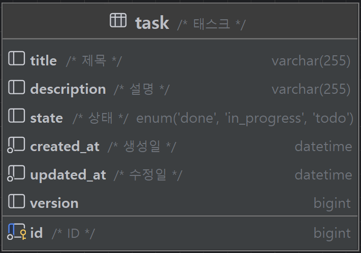
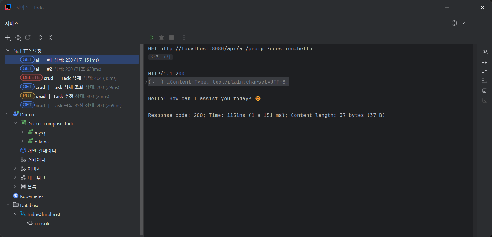

## 1. 개요
### 1.1. 소개
- 이 프로젝트는 todo backend api를 제공하는 서비스입니다.
- 할일(Task)에 대한 CRUD, AI를 통한 대화와 Task 생성 예시를 제공합니다.
### 1.2. 테이블
단일 애그리거트 루트 도메인 하나로만 구성했습니다. 

- id: TSID 로 설정해 향후 분산 데이터베이스 환경에서도 유일성을 보장합니다.
- title: 할일 제목입니다.
- description: 할 일에 대한 설명입니다.
- state: enum 으로 된 할 일의 상태입니다. `TODO`, `IN_PROGRESS`, `DONE` 으로 구성되어 있습니다.
- created_at: 할 일이 생성된 시간입니다.
- updated_at: 할 일이 수정된 시간입니다.
- version: JPA의 낙관적 락을 적용했습니다. 다른 사용자들과 공유하지 않는 데이터이고, 자신의 계정에서 여러 기기로 제어했을 때의 충돌을 방지하기 위함입니다.

### 1.3. 설계 키포인트
- RFC7807 을 준수하며, 예외 처리를 통해 클라이언트에게 상세한 정보를 제공합니다.
- hateoas 를 준수하며, 클라이언트에게 다음에 할 수 있는 행동을 알려줍니다. 응답 형태는 projection 으로 데이터를 부분적으로 받을 수 있습니다.
- resource 에 있는 설정(yaml)파일을 구조적으로 나누었습니다.
- DB 형상관리를 적용해 버전 별로 데이터베이스를 관리합니다.
- 단위, 통합 테스트코드를 작성했습니다.

## 2. 실행 방법
1. `docker compose up -d` 명령어로 컨테이너를 실행합니다(Docker 설치 필요).
2. `./gradlew bootRun` 명령어로 애플리케이션을 실행합니다.
3. `http://localhost:8080` 으로 접속합니다.
4. `resources/http` 폴더에 있는 http 파일을 이용해 API를 테스트할 수 있습니다. 혹은 애플리케이션 실행 전에 `./gradlew test` 명령어로 테스트를 실행할 수 있습니다.

## 3. 주요 라이브러리
### Test 부문
- 단위 테스트 용으로 `JUnit5`를, 복합 검증을 위해 `hamcrest`를, 픽스처 생성으로 `naver fixture monkey`를 사용했습니다. 다량의 랜덤데이터를 만들 수 있어 엣지케이스를 찾기 쉽습니다.
- 통합 테스트 목적으로 `testcontainer` 를 사용했습니다. 컨테이너를 활용하므로 환경 제약이 적습니다.
- 엔드포인트 테스트를 위해 `rest-assured`를 사용했습니다. 종단/화면단은 BDD 스타일로, 모듈/코어는 TDD 스타일을 선호합니다.

### 데이터 처리 부문
- 빠른 프로토타입 생성 목적으로 `jpa`를 사용했습니다. 기 규모있는 시스템의 데이터 가공시에는 `mybatis`, `jooq`를 선호합니다.
- `spring data rest`를 사용해 `hateoas`를 구현한 REST API를 제공했습니다. 개발 검증 화면으로 `hal explorer`를 제공했습니다.
- 데이터 검증은 `spring validation`을 사용해 각 레이어 경계별(`controller`, `service`, `repository`)로 검증하고 있습니다.
- 데이터 형상관리로 `flyway`를 사용했습니다. 유비쿼터스 언어 관리차원에서는 `liquibase`를 선호합니다.
- `mapstruct`를 사용해 엔티티와 DTO간 변환을 처리하고 있습니다. 복합 객체로 구성된 구조에서는 `modelmapper`를 선호합니다.
- 명세서는 통상 `swagger`로 구현해왔습니다만, 이번 프로젝트에서는 `smart-doc`를 사용해보았습니다. `swagger`관련 코드는 인터페이스로 분리해도 되나 코드침투를 여전히 허용하며, 실행 속도에서 영향을 미칩니다. `smart-doc`는 애플리케이션을 실행하지 않아도 되며, JavaDoc를 읽어 다양한 형태의 문서로 재가공할 수 있는 이점이 있어 중국에서 인지도가 급상승하고 있는 라이브러리입니다.

### 로직 처리 부문
- AI 사용목적으로 `ollama`를 사용했습니다. 여러 학습 모델을 지원하며, 근래 급부상하는 'deepseek r1'를 사용해봤습니다. 
- 메시지 제공(message-source)을 기존 properties 대신 yaml를 사용했습니다. 코드의 중복을 줄이고 가독성을 높이기 위함입니다. 사용 방식은 `resources/mesages/exception.yml` 에 있습니다. 다국어 처리에도 유용합니다.

## 4. API 명세
- openapi 형식으로 제공합니다. github page 로 접근할 수 있습니다.

## 5. 실행 결과 화면
